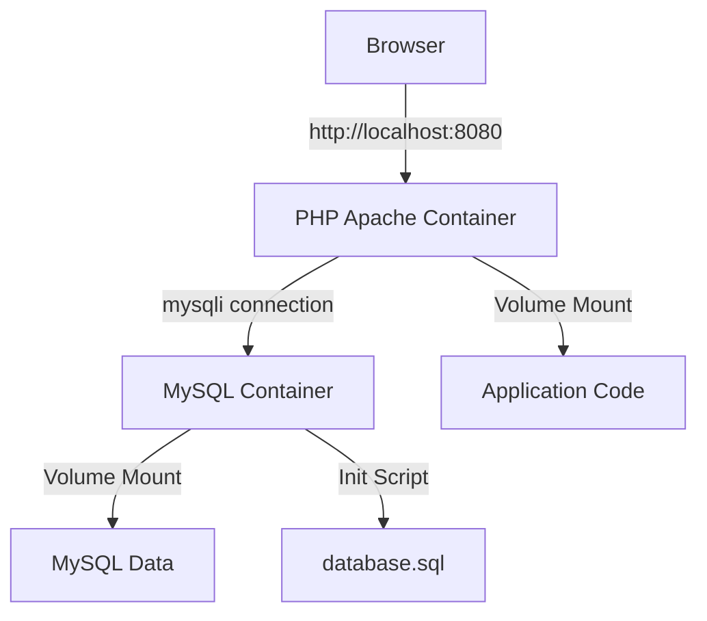

# Docker Setup Plan - Hospital RM Search

## Overview
Rencana untuk mendockerize aplikasi Hospital RM Search agar dapat berjalan di localhost dengan konfigurasi:
- **Database User**: root
- **Database Password**: secret123
- **Database Name**: hospital_rm
- **Web Port**: 8080 (http://localhost:8080)
- **Database Port**: 3306 (internal)

## Architecture



## Components to Create

### 1. Dockerfile
**Purpose**: Build PHP 8.1 dengan Apache dan ekstensi yang diperlukan

**Key Features**:
- Base image: `php:8.1-apache`
- Install mysqli extension
- Enable Apache mod_rewrite
- Set working directory ke `/var/www/html`
- Copy application files

### 2. docker-compose.yml
**Purpose**: Orchestrate multi-container setup

**Services**:
- **web**: PHP/Apache container
  - Port: 8080:80
  - Depends on: db
  - Volume: mount source code
  - Environment: database credentials

- **db**: MySQL 8.0 container
  - Port: 3306 (internal only)
  - Environment: root password, database name
  - Volume: persistent data storage
  - Init script: database.sql

### 3. .env File
**Purpose**: Centralized environment configuration

**Variables**:
```
DB_HOST=db
DB_USER=root
DB_PASS=secret123
DB_NAME=hospital_rm
MYSQL_ROOT_PASSWORD=secret123
MYSQL_DATABASE=hospital_rm
```

### 4. Updated config/database.php
**Purpose**: Read database credentials from environment variables

**Changes**:
- Replace hardcoded values with `getenv()`
- Support both Docker and local development
- Fallback to default values if env vars not set

### 5. .dockerignore
**Purpose**: Exclude unnecessary files from Docker build

**Excludes**:
- .git/
- .env
- README.md
- *.md files
- .gitignore

### 6. docker-entrypoint-initdb.d/
**Purpose**: Auto-initialize database on first run

**Contents**:
- Copy database.sql to init directory
- MySQL will automatically execute on container creation

### 7. DOCKER_SETUP.md
**Purpose**: Complete documentation for running the application

**Sections**:
- Prerequisites
- Quick Start
- Detailed Setup Steps
- Accessing the Application
- Stopping/Restarting
- Troubleshooting
- Database Management

## File Structure After Setup

```
devinta-rm/
├── Dockerfile
├── docker-compose.yml
├── .env
├── .dockerignore
├── DOCKER_SETUP.md
├── DOCKER_PLAN.md (this file)
├── database.sql
├── config/
│   ├── database.php (updated)
│   └── session.php
├── assets/
├── *.php files
└── README.md
```

## Workflow

### Initial Setup
1. User runs: `docker-compose up -d`
2. Docker builds PHP/Apache image
3. Docker pulls MySQL 8.0 image
4. MySQL container starts and initializes database
5. PHP container starts and connects to MySQL
6. Application accessible at http://localhost:8080

### Development Workflow
1. Edit code locally
2. Changes reflected immediately (volume mount)
3. No need to rebuild container for code changes
4. Restart containers if needed: `docker-compose restart`

### Database Access
- **From application**: Automatic via mysqli
- **From host**: `docker exec -it devinta-rm-db-1 mysql -uroot -psecret123 hospital_rm`
- **phpMyAdmin** (optional): Can add as additional service

## Security Considerations

1. **Production Warning**: 
   - Change default credentials
   - Use secrets management
   - Don't commit .env to git

2. **Network Isolation**:
   - MySQL not exposed to host
   - Only PHP container can access database

3. **Volume Permissions**:
   - Ensure proper file permissions
   - MySQL data persisted in named volume

## Testing Checklist

- [ ] Docker containers build successfully
- [ ] MySQL initializes with database.sql
- [ ] PHP can connect to MySQL
- [ ] Application loads at http://localhost:8080
- [ ] Login works (admin/admin123)
- [ ] Can add/edit/delete patients
- [ ] Data persists after container restart
- [ ] No permission errors

## Advantages of This Setup

1. **Portability**: Run anywhere Docker is installed
2. **Isolation**: No conflicts with local PHP/MySQL
3. **Consistency**: Same environment for all developers
4. **Easy Reset**: `docker-compose down -v` for clean slate
5. **Version Control**: Infrastructure as code
6. **Quick Setup**: One command to start everything

## Next Steps

After reviewing this plan:
1. Switch to **code mode** to implement the Docker setup
2. Create all necessary files
3. Test the setup locally
4. Provide final instructions to user

## Questions for User

Before implementation, please confirm:
1. ✅ Port 8080 for web access is acceptable?
2. ✅ MySQL credentials (root/secret123) are correct?
3. ✅ Need phpMyAdmin container for database management?
4. ✅ Any additional PHP extensions required?

---

**Ready to proceed?** If this plan looks good, I'll switch to code mode and implement the complete Docker setup.
